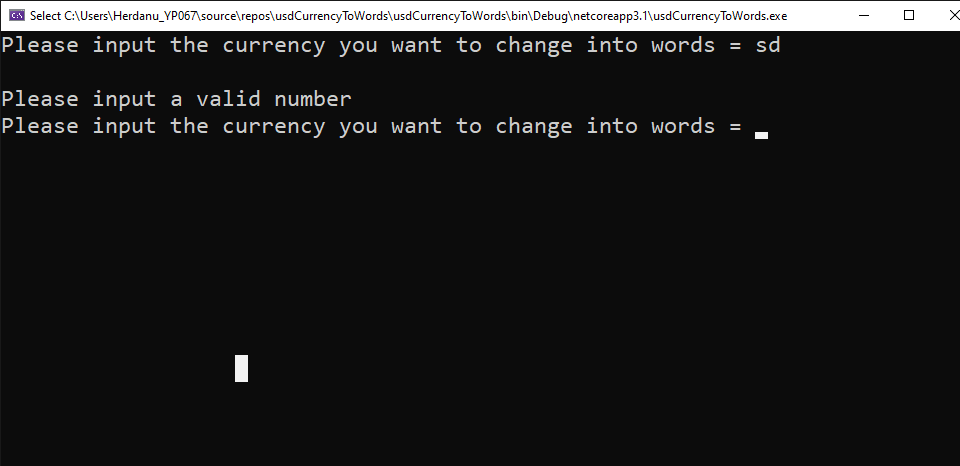
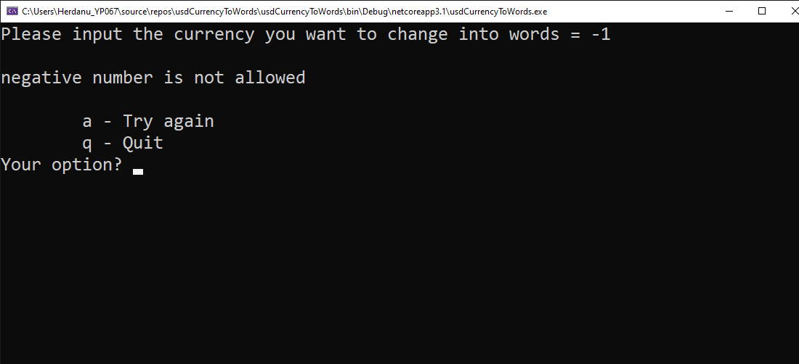
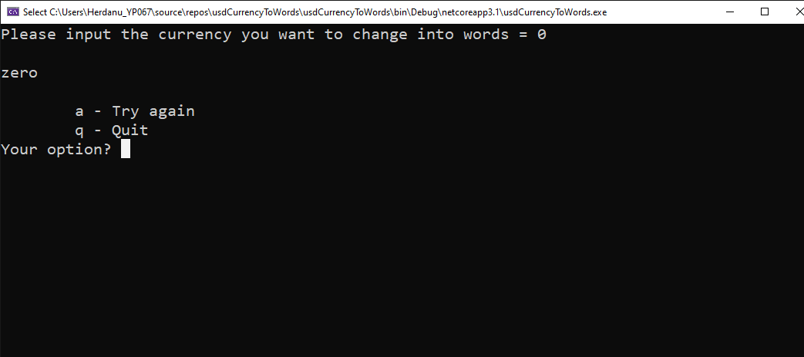
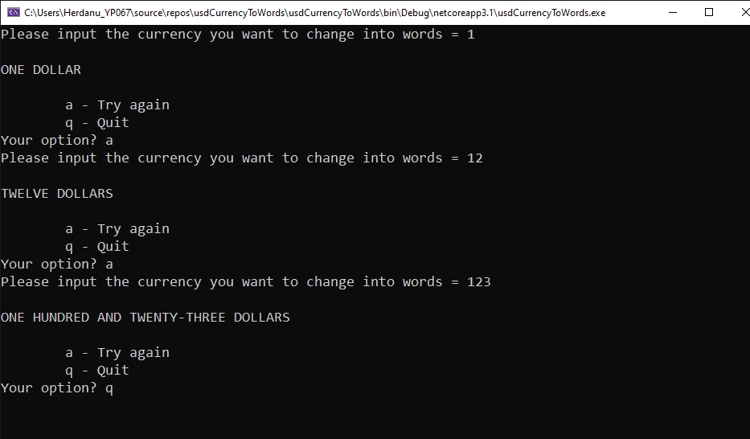
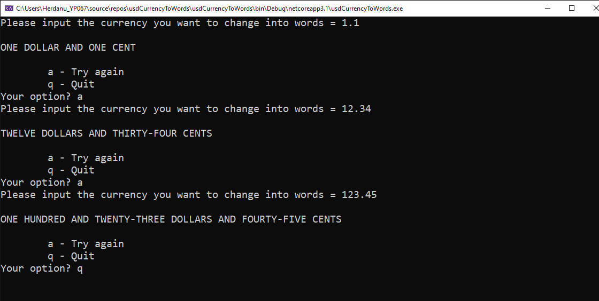

# Console Program Write in C#

> This program is to convert input of numbers into a words, which is passed a number as input and converts this number into words and passes these words as a string output parameter. Such a routine is typically use by a cheque writing program. _(In this case is a US Dollar)_

Example :

```sh
input = "123.45"
ouput =  “ONE HUNDRED AND TWENTY-THREE DOLLARS AND FORTY-FIVE CENTS” 
```

---

## Output Explanation
- This program only accept a valid input of number. If it's not valid, then the program will ask you to put a valid input.

  

- Check if input is negative number, if yes then the program will not process it and immediately give an invalid response.

  

- Check if input is 0, if yes then the program just simply response zero.

  

- Check if input is a Decimals or Integers by looking for any dot (`.`) in the input.
  
  - If there isn't any dot (`.`), then it going to show the usual response.

  

  - If there is a dot (`.`), then it going to show the usual response follow by decimals number into a cent(s).

  

---

**_&copy; 2020 Herdanu Yudistira Putra. All right reserved._**
